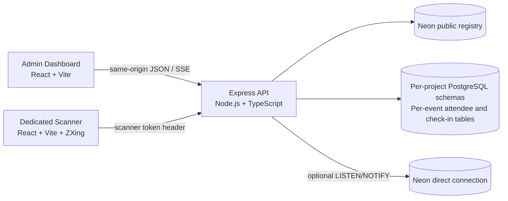

# Eventdesk — Event Management & QR Check-in

A TypeScript monorepo for multi-project event operations: an organizer dashboard, a separately built mobile scanner, and an Express API backed by Neon Serverless PostgreSQL.

## Architecture



- `apps/admin` — React/Vite organizer dashboard, project/event operations, attendee list, live analytics, scanner-link management, and PDF badge designer.
- `apps/scanner` — separately buildable, mobile-first camera/manual scanner. Production serves this bundle under `/scanner/*` from the API container; in development the admin Vite server proxies `/scanner/*` to the separate scanner Vite process.
- `services/api` — Express routes, local username/password sessions, project/event authorization, Neon migrations and tenant provisioning, QR issuance, idempotent check-in, analytics and SSE.
- `packages/contracts` — canonical Zod request/response schemas, runtime serializers, and inferred TypeScript DTOs consumed by the API and both clients.

## Local organizer login and security

Organizer access uses a local **username and password**, not Manus OAuth. The login page offers one-time setup when no local credentials exist and the organizer registry is empty or contains exactly one legacy organizer. If that sole legacy row exists, setup attaches the local username/password to its existing UUID and clears the unused provider ID, preserving project ownership. Setup is serialized in PostgreSQL, blocked when multiple legacy organizers make the owner ambiguous, and closes after the first local account is created. No default credentials or later public self-registration are provided.

Passwords are stored as salted scrypt hashes (N=32768, r=8, p=1), checked with a constant-time comparison, and never returned by the API. Login and first-run setup are rate-limited. The application issues its own HttpOnly `eventdesk_session` cookie, signed for 12 hours using an HKDF-derived key from the protected `SESSION_SECRET`; the session-signing and QR-encryption keys use separate derivation contexts. The Preview cookie is Secure, SameSite=None, and Partitioned; local HTTP development uses SameSite=Lax. No Manus OAuth credentials are needed for app login.

Project membership is enforced before event data access. `public` holds organizer/project/event metadata, memberships, scanner-token hashes, badge layouts, and per-event badge-template metadata. Creating a project transactionally creates its UUID-derived PostgreSQL schema. Creating an event in that project transactionally creates UUID-derived attendee and check-in tables in that schema. Attendee tables include a validated `custom_fields jsonb` object, added idempotently to existing tenants during API startup/repair. Tenant SQL identifiers are validated against generated-name patterns and quoted; user-supplied labels and values remain bound parameters. The API does not mutate `search_path`.

Attendee QR credentials are random opaque tokens. The QR contains no attendee PII; Neon stores the token's SHA-256 lookup hash and AES-256-GCM encrypted copy (only for an organizer-authorized reprint). Scanner URLs are bearer credentials stored as hashes, scoped to one event, expiring, and revocable. Check-in row locks and one unique event check-in per attendee make duplicate/concurrent scans idempotent. API responses are `private, no-store`.

Use **HTTPS** in deployed environments so browser camera access is available. Do not place secrets in client-side `VITE_*` values or commit `.env` files. Complete first-organizer setup in a trusted environment before exposing the site publicly.

## Neon configuration

Create a Neon PostgreSQL database and provide its **pooled TLS connection string** as protected `NEON_DATABASE_URL`. The configured database role must be permitted to create schemas, tables and indexes; project/event provisioning requires those DDL privileges. Optional `NEON_DIRECT_DATABASE_URL` enables PostgreSQL `LISTEN/NOTIFY` fan-out across API instances. When it is unavailable, organizer dashboard streams remain responsive through the built-in five-second durable-data refresh fallback.

A high-entropy `SESSION_SECRET` is required. HKDF derives the local organizer-session signing key from it, and a separately domain-derived AES key encrypts attendee QR tokens. An optional `QR_TOKEN_ENCRYPTION_KEY` overrides only the QR encryption key. Preserve the selected QR encryption key: replacing it prevents decryption/reprint of QR tokens already stored in Neon. In the managed runtime, badge PDFs use built-in durable object storage via server-only runtime credentials; the database stores the event-owned object key and metadata. No Cloudflare R2 account or browser storage secret is required.

`.env.example` lists variable names and safe placeholders only. For managed Cloud development, configure `NEON_DATABASE_URL` and `SESSION_SECRET` through the protected secret input surface, not in a committed file. Migrations run automatically at API startup and can also be run with `pnpm db:migrate`. `pnpm db:repair-tenants` checks registered project/event mappings and idempotently restores missing schemas/tables without dropping user data. `pnpm db:smoke` exercises the live Neon registry, tenant DDL, encrypted QR storage, and duplicate-check-in constraint inside a transaction that is rolled back.

## Local development

Requirements: Node.js 22 and pnpm 10.26.1 (the workspace package-manager pin is committed).

```sh
cp .env.example .env
# Fill the Neon connection string and SESSION_SECRET in the untracked .env file.
pnpm install
pnpm dev
```

- Admin + local Preview origin: `http://localhost:3000`
- Scanner Vite process: `http://localhost:3001/scanner/<eventId>`; the admin dev server also proxies `/scanner/*` to it on port 3000.
- API: `http://localhost:4100` (`PORT` overrides this in the container).
- On a fresh database, open `/login` and create the first organizer username/password. On later visits, sign in with those credentials.

Direct local processes do not automatically receive the managed runtime's storage credentials. PDF upload requires the managed runtime storage service; do not place platform credentials in browser code or commit them to `.env`.

`pnpm dev:admin`, `pnpm dev:scanner`, and `pnpm dev:api` run services separately.

## Product behavior and API surface

All application routes share the same origin. Authenticated project/event/attendee/layout/dashboard and scanner-branding edit routes enforce organizer membership. The dedicated staff scanner route is public and uses an event-scoped `X-Scanner-Token` bearer token instead of organizer cookies; staff open the complete tokenized scanner URL and never need the organizer username/password. The scanner's non-sensitive event brand settings are public to that route, while edits remain organizer-only.

| Method and path | Purpose |
| --- | --- |
| `GET /api/auth/setup-status` | Report whether the one-time first-organizer setup is still available. |
| `POST /api/auth/setup` | Create the first organizer with a username/password while the organizer registry is empty, then issue a session. |
| `POST /api/auth/login` | Verify username/password and issue a local organizer session. |
| `GET /api/auth/me`, `POST /api/auth/logout` | Read or clear the local organizer session. |
| `GET/POST /api/projects` | List accessible workspaces or create a project and isolated schema. |
| `GET/PATCH/DELETE /api/projects/:projectId` | Read or rename a workspace; project owners may delete the project and its isolated schema. |
| `GET/POST /api/projects/:projectId/events` | List events or create an event with attendee/check-in tables. |
| `GET/PATCH/DELETE /api/events/:eventId` | Read/edit event context; project owners may delete its tenant tables. |
| `GET/POST /api/events/:eventId/attendees` | Search/filter guest records or issue one attendee and their QR image; custom values are validated and stored in that event's isolated JSONB attendee field. |
| `POST /api/events/:eventId/attendees/bulk` | Atomically import up to 500 attendees; CSV headers beyond `name`, `email`, and `ticketType` become attendee custom fields. |
| `GET /api/events/:eventId/attendees/:attendeeId/qr` | Recreate an authorized attendee QR from encrypted-at-rest token storage. |
| `GET /api/events/:eventId/attendees/:attendeeId/badge.pdf` | Download an attendee-specific designed PDF using the saved template, normalized layout, attendee fields and encrypted QR credential. |
| `GET /api/events/:eventId/attendees/fields` | List all custom attendee field names available for badge mapping, without limiting the catalog to the current attendee page. |
| `POST /api/events/:eventId/scanner-links`, `GET /api/events/:eventId/scanner-links`, `DELETE /api/events/:eventId/scanner-links/:linkId` | Issue, list, and revoke expiring staff links. New links keep a one-way validation hash plus purpose-separated AES-GCM ciphertext for copy; raw tokens are never stored. |
| `POST /api/events/:eventId/scanner-links/:linkId/copy` | Organizer-authenticated, event-scoped retrieval of the same active, unexpired staff URL. The endpoint is no-store; older hash-only links cannot be recovered and are not rotated automatically. |
| `GET /api/events/:eventId/scanner-session` | Validate a staff bearer token and return the event/label needed by the scanner UI. |
| `GET /api/events/:eventId/scanner-branding` | Return non-sensitive event scanner branding for public staff display; unsaved events use the default ALMIRA AUREA identity. |
| `PUT /api/events/:eventId/scanner-branding` | Organizer-authenticated save for the event name/descriptor, a PNG/JPEG/WebP logo up to 256 KB, and scanner colors. |
| `POST /api/events/:eventId/check-ins` | Register a valid, duplicate, or invalid scan; accepts the organizer session or scanner token. |
| `GET /api/events/:eventId/dashboard`, `GET /api/events/:eventId/stream` | Read analytics/recent activity and subscribe to SSE updates. |
| `GET/PUT /api/events/:eventId/badge-layout` | Read or save event-specific normalized badge positioning. |
| `GET/PUT /api/events/:eventId/badge-template` | Read or replace event-owned PDF template metadata; upload bytes go to durable object storage and its stable object key/page metadata are indexed in Neon. |
| `GET /api/events/:eventId/badge-template/file` | Restore the organizer-owned PDF through a same-origin API response that fetches the object server-side using a short-lived signed URL. |
| `GET /api/health` | Unauthenticated API/database health response. |

The scanner frontend verifies its staff link before starting the camera, stores it in session storage, removes its token query parameter from the address bar, and uses manual entry as a fallback. It is a public staff route: opening the dedicated URL is sufficient, and an unrelated organizer cookie does not override a valid staff token. Admins can rebrand each event's scanner from the **Scanner design** page; the logo and palette apply to the live scanner without changing existing staff URLs. Success, duplicate and invalid states retain distinct green, amber and red colors; attendee identity is shown once in result cards, and the mobile footer wraps rather than overflowing. Admins can copy the exact same current staff URL from an eligible link row; links issued before encrypted recovery was added remain hash-only and cannot be reconstructed or rotated automatically.

## PDF badge designer

The designer accepts a PDF template up to 20 MB and renders up to 200 selectable pages in the browser. The original PDF is uploaded to durable managed object storage and restored automatically through an authenticated same-origin API when the event designer is reopened; its event-owned object key, filename and page metadata are indexed in Neon. Drag or click to add a QR, guest name, email, ticket type, event name, any custom attendee field, custom/static text, or PNG/JPEG image; move and resize each overlay; adjust text size/color; zoom the canvas; and select an attendee to create their personalized PDF. The attendee list and issuance results also provide a one-click designed badge PDF download; the separate QR-image action is explicitly QR-only. Add attendee custom fields manually or import arbitrary named CSV columns; event field names are catalogued independently of the current 500-row attendee page. Positions are saved as normalized page-relative coordinates and converted to PDF points with the correct top-left to bottom-left origin. The normalized layout and small image data URLs are also stored with the event.

## Checks and build

```sh
pnpm typecheck
pnpm test
pnpm build
pnpm ignored-builds
pnpm db:smoke # optional; requires Neon DDL privileges and rolls back synthetic test rows
```

`pnpm build:web` builds the admin and standalone scanner outputs under `dist/`; `pnpm build:api` compiles the API. Every successful API JSON serializer validates its payload against the shared response schema; the admin and scanner clients parse those same schemas at runtime, while 204-only routes reject unexpected response bodies. API tests cover public scanner check-in router ordering (an invalid staff token must reach token validation instead of organizer login), public branding reads versus organizer-only writes, logo MIME/signature/size validation, local password hashing, organizer session signing/cookie policy, auth request validation, scanner-link hash-plus-ciphertext issuance, explicit same-URL recovery and event-membership enforcement, legacy link redaction, all membership roles, event dashboard consistency, check-in variants, badge-layout nullability, attendee custom-field and template contracts, managed-storage upload/download credential isolation, PDF badge rendering, normalized request serialization, safe deterministic tenant identifiers, and QR/scanner-token encryption/tampering. Typechecking covers all four workspace packages.

## Deployment

The managed Web project has the server capability enabled, with a hybrid serving declaration: static admin output from `dist/`, the Express container for `/api/*` and `/scanner/*`, immutable caching for versioned `/assets/*`, and SPA fallback for the admin app. The scanner remains a distinct Vite app/build but is bundled into the container for direct `/scanner/:eventId` routes. The container health path is `/api/health` and the API honors the injected `PORT`.

The repository includes a multistage `Dockerfile`; the static build command explicitly installs dependencies from the committed lockfile. Deployment configuration does not publish the website by itself. Publishing is intentionally not triggered by this implementation task.
